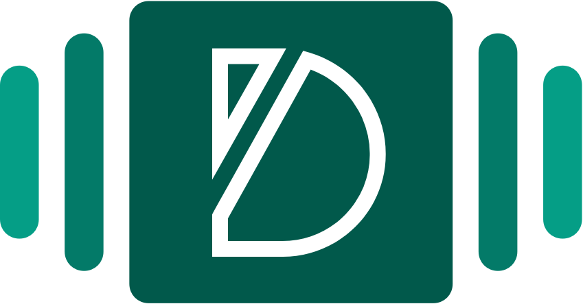

<p align="center">
  <a href="https://deckjs.netlify.com">
    
  </a>
</p>

<h1 align="center">
  DeckJS
</h1>

<h3 align="center">
  🐇 :rocket: 🍿
</h3>
<p align="center">
  <strong>Create your best presentation, as a static webapp with DeckJS</strong><br>
  Get into the deck to web methodology. Let your web deck pitch your visitors.
</p>

Deck is a modern framework that lets you turn slide decks into fast, great looking webapps.

-   **Share what you want in the best format** 
    Get all the benefits of sharing information as a slide deck. Simple, minimalistic, elegant. 🎩

-   **Keep the web powers** 
    Slide decks are an amazing way of showcasing information, but in a world as wide as the web, 
    it's powers are not enough. Get the best out of both worlds, keep the slides format, keep the 
    webapp superpowers! 😱
    
-   **Keep it Simple, Saxophone**
    Creating a web to shwocase some information shouldn't take ages. Creating  slide deck doesn't, 
    why would a web? Turn your ideas into reality in a matter of minutes using the Store 🐇
    
-   **Write in JS**
    Oh come on, you know you love the fact that we are using React as much as we do! ❤️
    
## What’s In This Document

-   [Get Up and Running in 5 Minutes](#-get-up-and-running-in-5-minutes)
-   [Learning Deck](#-learning-deck)
-   [Contribuite to Deck](#-contribuite-to-deck)
-   [Join the family](#-join-the-family)

## 🚀 Get Up and Running in 5 Minutes

You can get a new Deck up and running on your local dev environment in 5 minutes with these three steps:

1.  **Create a Deck template with our npm package.**

    Get your deck set up in a single command:

    ```sh
    # clone the project
    git clone git@github.com:borjadotai/DeckJS.git
    ```

2.  **Start the site in `develop` mode.**

    Next, move into your new site’s directory and start it up:

    ```sh
    # get inside the project
    cd deckJS
    # get it running in dev mode
    yarn dev
    ```

3.  **Open the source code and start editing!**

    Your site is now running at `http://localhost:8000`. Open the the `my-blazing-deck` directory in your code editor of choice (which will probably be VSCode or Atom 😜) and start editing. Save your changes and the browser will update in real time!

At this point, you’ve got a fully functional Deck! For additional information on how you can customize your Deck, keep on reading this guide.

## 🎓 Learning Deck

Hello and welcome to the ultimate guide to learn how to use DeckJS! 🍿🥤

Let me start by telling you about the topics we are going to cover:

- Structure (How does deck look behind the scenes)
- Cover (What's the cover for)
- Store (How do I use the store)
- Content (Creating content in slides - Components)
- Ready? Launch it! 🚀 (How to deploy)

### Structure 
The moment you create a new template with Deck, you'll find a structure with the following relevant files and folders:
```
| node_modules (no explanation needed lol)
| public (this is were your static webapp will be when built)
| src
- | assets (place for all non code)
- | components (Necessary components storage)
- - | Cover.js (Main slide that you'll need to edit)
- | data
- - | content (Where the components that act as slide content live)
- - - | slide1 (example)
- - - | slide2 (example)
- - - | slide3 (example)
- - | Social.js (Social media setup)
- - | Store.js (THE STORE)
- | layouts
- - | all.scss (All styles are setup here)
- - | index.js (Main layout file)
- - | styles.scss (Custom scsss - worth having a look)
| gatsby-config.js (If you want to install any gatsby plugin)
```
Now that you have an idea of how a project looks like, let's get into understanding how everything works together.

### Cover
Even thought we are using the powerful slide deck format, we still are creating a webapp and so, if you want to have a very different and personal front page / main slide on top of everything else and a first piece of content, you can do so! 

The cover is the only slide that you can fully modify. As you can see in the structure, Cover.js is a file that lives inside src/components. As you can imagine, it is a component itself. If you have experience with React, feel free to go ahead and modify that component as you want! 

If you're new to react, it might be worth having a read at <a href="https://reactjs.org/">React</a> and <a href="https://www.gatsbyjs.org/">Gatsby</a>

If you've played with component before, let me introduce you to a couple of friends:

- <a href="">Bulma</a>: Bulma is a great CSS framework that we use as base for our styles. 

- <a href="">Bloomer</a>: React library based on Bulma that had built in components usign those styles.

```js
<Hero isFullHeight isColor="primary">
    <HeroHeader>
      <Header />
    </HeroHeader>

    <HeroBody>
      <Container hasTextAlign="centered">
        
        <Title className="is-size-2 is-size-4-mobile has-text-weight-light">
          Create your best presentation, as a <span className="has-text-weight-normal">static webapp</span> with <span className="has-text-weight-normal">DeckJS</span>.
        </Title>
        <Title className="is-size-3 is-size-5-mobile has-text-weight-light">
          Thanks for having installed DeckJS. Welcome to a new way of making webs.
        </Title>
        <Title className="is-size-4 is-size-6-mobile has-text-weight-light">
          Please give a star and upvote or like on whatever platform you found us! 🙏❤️
        </Title>
        <div className="isCentered">
          <iframe src="https://ghbtns.com/github-btn.html?user=borjadotai&repo=deckjs&type=star&count=true&size=large" frameborder="0" scrolling="0" width="160px" height="30px"></iframe>
          <iframe src="https://ghbtns.com/github-btn.html?user=twbs&repo=bootstrap&type=fork&size=large" frameborder="0" scrolling="0" width="158px" height="30px"></iframe>
        </div>
      </Container>
    </HeroBody>
  </Hero>
```

As you can see in the previous code, there is a big component called `<Hero>`, Heros define the slides that we use. We reccommend to keep this structure and just modify the content inside the `HeroHeader` and `HeroBody`. Here you have some more information around <a href="https://bloomer.js.org/#/documentation/layout/hero">Heros</a>!

## 🤝 Contribuite to Deck

If you feel like there's anything that should be different, any bug or simply any feature that you would like to see on DeckJS, please feel free to create a new issue, make a PR or contact me!

This is an Open Source project and so we would love to see as many people as possible involved collaborating to make Deck evolve day after day! Join us and make webs great again 😜😂

## ❤️ Join the family

Are you planning to use or have you used Deck already? 
Mind telling us what you made? We are putting together a portfolio section on the official web and we would love to add a small thumbnail with a link to your deck to show what amazing things can be built with DeckJS!
If that's you, please tweet with #madewithDeck and we'll get in touch with you or just drop me a msg!

## ☕️ Buy me a coffee?

This project has been made with lots of love, music and coffee by @borjadotai. If you want me to keep on making free cool stuff, <a href="https://monzo.me/borjaleiva">mind taking me for a coffee?</a> 👻 
